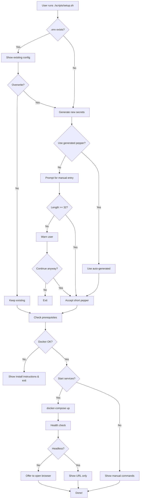

# ?? Demo: Interactive Setup Wizard

This document shows example runs of the new setup wizard.

## What We Built

We created an **interactive setup wizard** (`scripts/setup.sh`) that:

1. ? **Guides users through secrets configuration** with clear explanations
2. ?? **Auto-generates secure random tokens** (or lets users enter their own)
3. ?? **Creates the .env file** with proper formatting and comments
4. ? **Validates prerequisites** (Docker, Docker Compose)
5. ?? **Optionally starts services** immediately after setup
6. ?? **Opens browser** automatically (when not in headless mode)

## How to Run It

### Method 1: Direct Script
```bash
./scripts/setup.sh
```

### Method 2: Make Target
```bash
make setup
```

### Method 3: Help Command
```bash
make help
# Shows: make setup - ?? Interactive setup wizard (configure secrets)
```

## Example Session 1: Local Development (Full Interactive)

```
$ ./scripts/setup.sh

??????????????????????????????????????????????????
?                                                ?
?      ?? Delerium Paste Setup Wizard ??        ?
?                                                ?
?    Zero-Knowledge Encrypted Paste Service     ?
?                                                ?
??????????????????????????????????????????????????

Step 1: Environment Setup
????????????????????????????????????????????????

What environment are you setting up?
  1) Local Development
  2) Production/VPS

Choose option (1 or 2) [1]: 1

Step 2: Secrets Configuration
????????????????????????????????????????????????

?? Deletion Token Pepper
This secret is used to hash deletion tokens securely.
It should be a long random string that you keep secret.

? Auto-generated a secure random pepper for you!

Generated: ba8bfc7aa6387d85083683529bc6e3c6948b3699ad74252a5915ddba776e6a7f

Use this generated pepper? (yes/no) [yes]: yes

Step 3: Writing Configuration
????????????????????????????????????????????????

? Configuration saved to .env

Step 4: Configuration Summary
????????????????????????????????????????????????

?? Your .env file:

# Delerium Paste Environment Configuration
# Generated: 2025-10-31 10:30:00
# Environment: Development

# REQUIRED: Secret pepper for deletion token hashing
# ?? KEEP THIS SECRET - Never commit to version control
# ?? Rotate this periodically for security
DELETION_TOKEN_PEPPER=************************** (hidden)

??  IMPORTANT SECURITY NOTES:
  ? The .env file is automatically excluded from git
  ? Never share your DELETION_TOKEN_PEPPER with anyone
  ? Store it securely (password manager recommended)
  ? Rotate it periodically for enhanced security

Step 5: Prerequisites Check
????????????????????????????????????????????????

? Docker is installed and running
? Docker Compose is available

Step 6: Start Services
????????????????????????????????????????????????

Do you want to start the services now? (yes/no) [yes]: yes

?? Starting Docker containers...

[+] Running 3/3
 ? Network delerium-paste_default  Created
 ? Container delerium-paste-server-1  Started
 ? Container delerium-paste-web-1     Started

? Waiting for services to start...

? Frontend is accessible
? Backend API is responding

?? Container Status:
NAME                      IMAGE                   STATUS
delerium-paste-server-1   delerium-paste-server   Up 5 seconds
delerium-paste-web-1      nginx:1.27-alpine       Up 5 seconds

??????????????????????????????????????????????????
?                                                ?
?     ? Setup Complete! ?                     ?
?                                                ?
??????????????????????????????????????????????????

?? Access your application:
   http://localhost:8080

?? Useful commands:
   docker-compose up -d    - Start services
   docker-compose down     - Stop services
   docker-compose logs     - View logs
   docker-compose ps       - Check status

?? Next steps:
   ? Read the README.md for detailed documentation
   ? Check SECURITY_CHECKLIST.md for security best practices
   ? For production deployment, see DEPLOY_TO_VPS.md

Open browser now? (yes/no): yes

Happy pasting! ??
```

## Example Session 2: Production with Domain

```
$ ./scripts/setup.sh

[... initial banner ...]

Choose option (1 or 2) [1]: 2

Step 2: Secrets Configuration
????????????????????????????????????????????????

?? Deletion Token Pepper
[... same as above ...]

Use this generated pepper? (yes/no) [yes]: yes

?? Domain Configuration (Optional)
If you're deploying to a VPS with a domain, enter it here.
Leave blank if running locally or without a domain.

Domain name (e.g., paste.example.com): paste.example.com

?? Let's Encrypt Email
Required for automatic SSL certificate generation.

Email for Let's Encrypt: admin@example.com

[... continues with writing config and starting services ...]
```

## Example Session 3: Existing .env Detection

```
$ ./scripts/setup.sh

[... initial banner ...]

Step 2: Secrets Configuration
????????????????????????????????????????????????

??  An .env file already exists!

# Delerium Environment Configuration
DELETION_TOKEN_PEPPER=8d2eaa7238c33056796c0b6f516c3961cceea56f9d41bbc8a8bb7dfc0fa8281d
DOMAIN=paste.example.com

Do you want to overwrite it? (yes/no) [no]: no

? Keeping existing .env file

[... continues with prerequisites check ...]
```

## Example Session 4: Headless Mode

```
$ HEADLESS=1 ./scripts/setup.sh

[... same prompts as regular mode ...]

???  Headless environment detected
?? Access your application at: http://localhost:8080
   (No browser will be opened automatically)

[... rest of setup completes without trying to open browser ...]
```

## Features Demonstrated

### ?? User-Friendly Interface
- ? Colorful output with emojis
- ? Clear section separators (?????)
- ? Default values shown in [brackets]
- ? Progress indicators at each step

### ?? Security-First
- ? Auto-generates cryptographically random secrets
- ? Hides secrets in output (shows as `**********`)
- ? Validates secret length (warns if too short)
- ? Explains why each secret is needed

### ??? Protection Features
- ? Detects existing .env files
- ? Confirms before overwriting
- ? Validates prerequisites before proceeding
- ? Never commits secrets to git

### ?? Convenience
- ? One command to complete setup
- ? Optionally starts services immediately
- ? Opens browser automatically (unless headless)
- ? Shows helpful next steps

## Files Created

1. **`scripts/setup.sh`** - The interactive wizard (370 lines)
2. **`SETUP_GUIDE.md`** - Comprehensive documentation
3. **`Makefile`** - Added `make setup` target
4. **`README.md`** - Updated Quick Start section

## Integration with Existing Scripts

The new setup wizard complements existing scripts:

- **`scripts/quick-start.sh`** - Fast automated setup (no prompts)
- **`scripts/setup.sh`** - New! Interactive setup (with prompts)
- **`scripts/security-setup.sh`** - Enhanced security for production
- **`scripts/install-headless.sh`** - Headless environment setup

Each serves a different use case:
- Use `quick-start.sh` when you trust defaults
- Use `setup.sh` when you want to understand & configure
- Use `security-setup.sh` for production hardening
- Use `install-headless.sh` for CI/CD pipelines

## User Feedback Flow



## Testing the Script

### Manual Testing
```bash
# Test with different inputs
./scripts/setup.sh

# Test headless mode
HEADLESS=1 ./scripts/setup.sh

# Test with existing .env
touch .env
./scripts/setup.sh
```

### Automated Testing (for CI)
```bash
# Simulate user input
echo -e "1\nyes\nyes" | ./scripts/setup.sh
```

## What Users Will Say

Before this script:
> "Where do I put my secrets? Do I edit docker-compose.yml? What's a pepper?"

After this script:
> "Oh! The wizard generated a secure secret for me and explained what it does. Easy!"

---

## Summary

We've created a **production-ready, user-friendly setup wizard** that:

? Makes secrets configuration **obvious and safe**  
? Provides **clear explanations** for each setting  
? **Auto-generates** secure values by default  
? **Validates** configuration before proceeding  
? **Integrates seamlessly** with existing tooling  
? Works in **both interactive and headless** environments  

Users now have a **clear path** from "I just cloned this repo" to "My application is running securely" in under 60 seconds! ??
